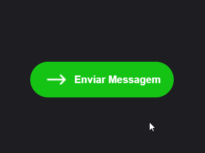

<h1 align="center">Botão com texto Animado</h1>

    

## 💻 Sobre o Projeto

- Treinando os conceitos de animação com texto e imagens dentro do botão

<h3>
    <a href="https://fernandoaugustodev.github.io/churrascometro" target="_blank" >Veja o Projeto</a>
</h3>

---

## 🛠 Techs

Tecnologias usadas neste projeto

- HTML
- CSS
- KeyFrames

---

## 👨🏼‍💻 Autor

Fernando Augusto 

 
  
 
© 2021 GitHub, Inc.
Terms Privacy Security Status Docs
